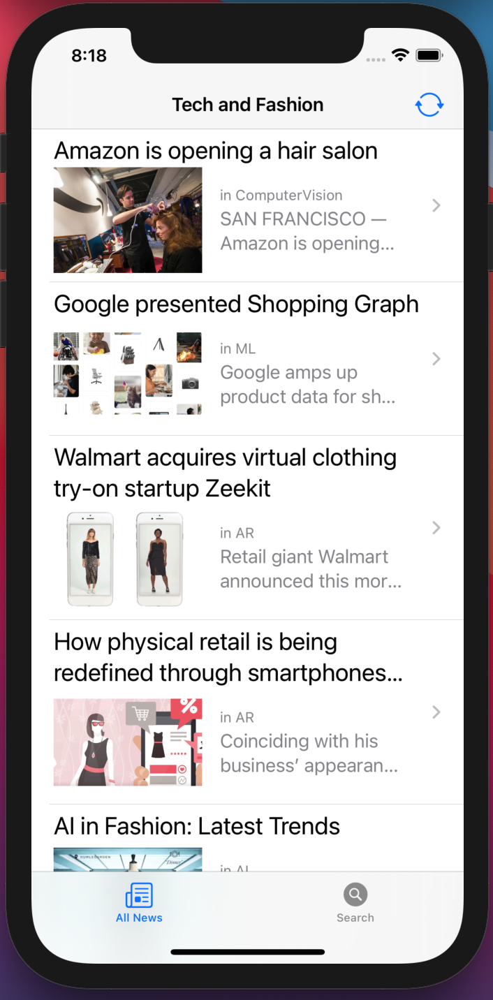
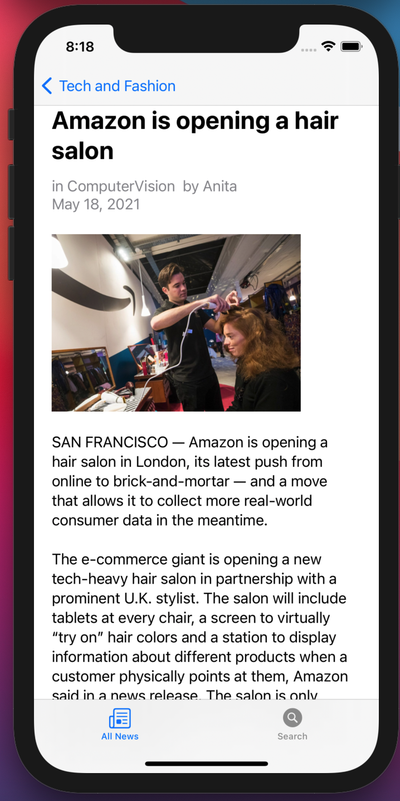
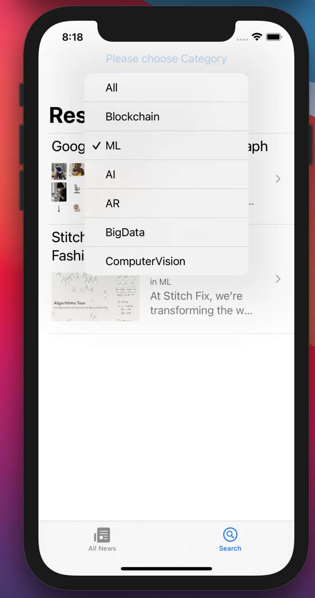
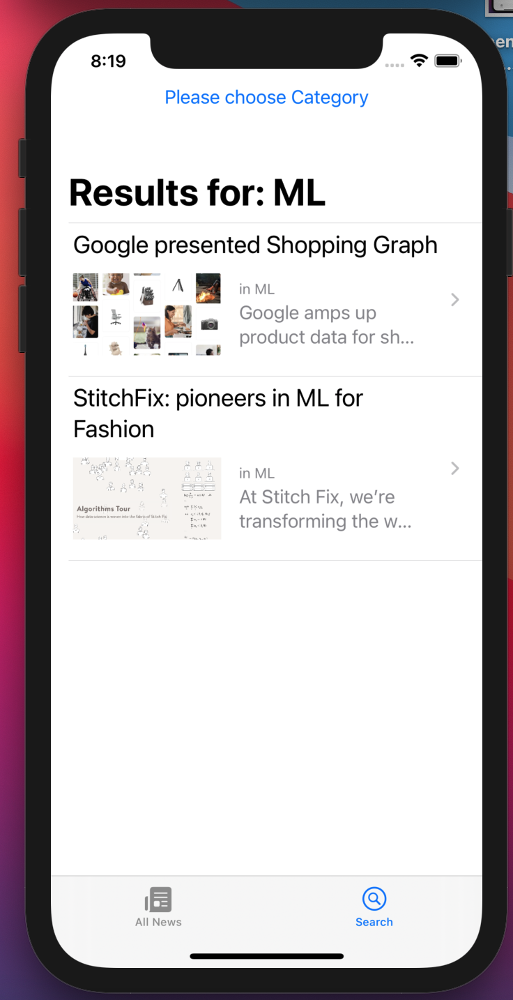

##  Fashion News App

[VideoDemo](https://youtu.be/mYnr6Ue9SgY)

The app uses custom REST API endpoints to display records from DB (stored in AWS DynamoDB). \
Each record is a news-type record with :
* a title
* an author
* a category
* a text
* an url link for an image associated with this record (stored in AWS S3 and configured to be accessable through AWS CloudFront)

### Features
* a user can check the list of the latest news
* a user can check details for each news
* a user can search news by a category
* a user can press an Update Button to download the latest news if there were any updates in the DB

Web that allows adding news to the DB [link](https://master.d2b6g6xmfhelha.amplifyapp.com/)
GitHub for web [link](https://github.com/anastaszi/277_web)

